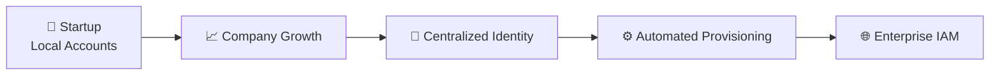
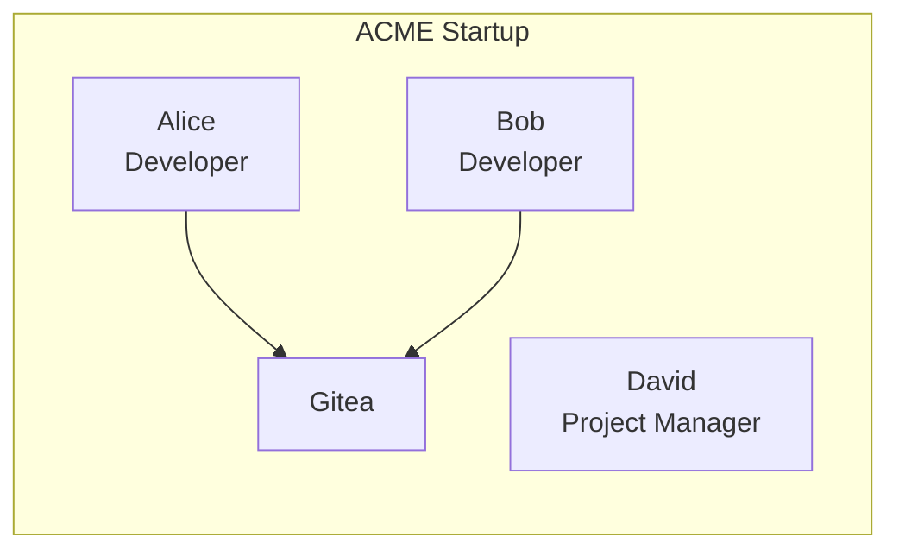
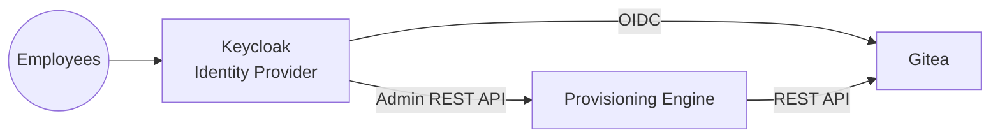
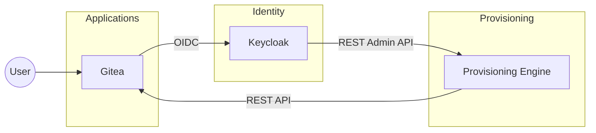
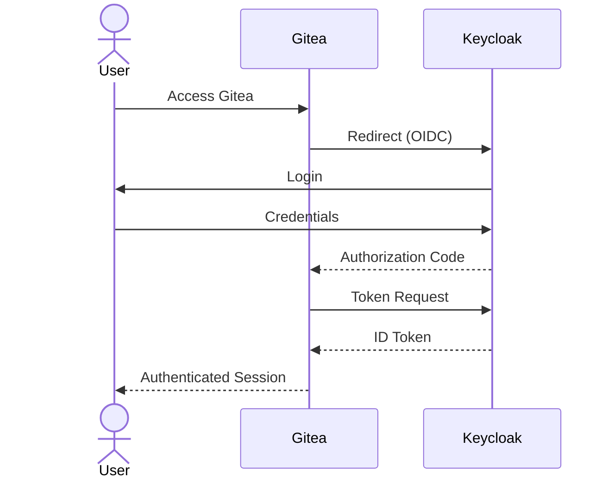
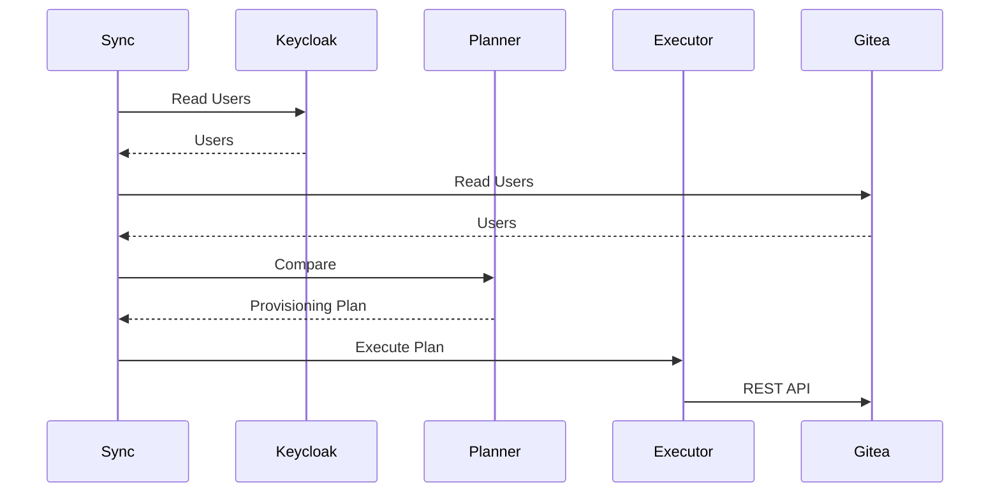
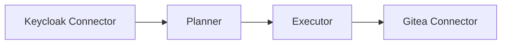

# IAM Labs

> A laboratory project demonstrating the design and implementation of a modern **Identity and Access Management (IAM)** architecture based on **Keycloak**, **OpenID Connect (OIDC)** and a custom **user provisioning engine**.

This project is intentionally built in iterations. Each architecture introduces new business requirements and new IAM concepts, allowing learners to evolve from basic authentication to enterprise identity management.

---

<p align="center">


</p>

---

# Table of Contents

- Introduction
- Learning Journey
- Learning Objectives
- Architecture Evolution
- Current Architecture
- Repository Overview
- Technology Stack
- Quick Start
- Usage
- Documentation
- Roadmap

---

# Introduction

IAM Labs is not just a collection of configuration files or a demonstration of Keycloak.

It is an incremental learning laboratory designed to simulate the evolution of a company's Identity and Access Management infrastructure.

The project starts with a simple startup environment where local authentication is sufficient. As the company grows, new business requirements emerge, leading to the introduction of centralized authentication, Single Sign-On, automated provisioning and, eventually, a complete IAM architecture.

Each architectural iteration introduces new concepts without replacing the previous ones, allowing learners to understand not only *how* an IAM solution is implemented, but also *why* architectural decisions become necessary as an organization evolves.

The laboratory is intended for students, junior IAM engineers and anyone interested in understanding the progressive adoption of enterprise Identity and Access Management practices.

---

# Learning Journey

The laboratory follows the evolution of a fictional software company called **ACME**.

Rather than presenting IAM concepts in isolation, the project introduces them progressively through a realistic business scenario.

As ACME grows, new business requirements emerge, requiring increasingly sophisticated Identity and Access Management solutions. Each architectural iteration introduces new concepts while building upon the previous one, allowing learners to understand both the implementation and the motivation behind each design decision.



The current implementation covers **Architecture 1**, introducing centralized authentication with Keycloak, Single Sign-On (SSO) using OpenID Connect, and automated user provisioning for Gitea.

Future iterations will extend the architecture by integrating additional enterprise services while preserving the same design principles.

---

# Learning Objectives

IAM Labs has been designed to progressively introduce the core concepts of Identity and Access Management.

By completing the laboratory, learners will gain practical experience with:

- Identity Providers
- OpenID Connect
- Single Sign-On
- User Provisioning
- Role-Based Access Control
- REST APIs
- Docker-based deployments
- Modular IAM architectures

Each iteration builds upon the previous one, reflecting the way IAM infrastructures evolve in real organizations.

---

# Architecture 0 — Local Authentication



### Characteristics

- Local authentication
- Local users
- Local passwords
- No Identity Provider
- Manual user management

David is an employee but does not require access to Gitea because he is not part of the development team.

For a small organization this architecture is simple, inexpensive and easy to administer.

---

# Company Growth

As ACME expands to approximately twenty employees, identity management rapidly becomes more complex.

New developers join the engineering team while additional internal services are expected to be introduced in the future.

Maintaining local users inside every application is no longer sustainable.

Several challenges appear:

- User creation becomes repetitive.
- Passwords are duplicated.
- User lifecycle management is manual.
- Authentication policies are inconsistent.
- Every application maintains its own user database.
- Employees need multiple credentials.

The company therefore decides to introduce a centralized Identity and Access Management solution.

---

# Business Requirements

The new infrastructure must provide:

- Centralized authentication
- Single Sign-On
- Centralized identity management
- Automated user provisioning
- Role-based application access
- Scalability for future applications

These requirements become the foundation for the next architectural iteration.

---

# Architecture 1 — Centralized Identity Management

Architecture 1 introduces a centralized Identity Provider implemented using **Keycloak**.

Authentication is delegated to the Identity Provider using **OpenID Connect**, while Gitea continues to manage repositories and repository permissions.

A custom provisioning engine synchronizes users from Keycloak into Gitea.



---

# Separation of Responsibilities

One of the main architectural goals is the separation of responsibilities.

| Responsibility | Component |
|----------------|-----------|
| Authentication | Keycloak |
| Identity Management | Keycloak |
| User Provisioning | Provisioning Engine |
| Authorization | Gitea |
| Repository Management | Gitea |

This separation reflects a common enterprise IAM architecture where authentication is centralized while each application remains responsible for authorization.

---

# Benefits

Compared to Architecture 0, the new solution provides:

- Centralized authentication
- Single Sign-On
- Automated provisioning
- Centralized user lifecycle
- Reduced administrative effort
- Better scalability
- Separation of concerns
- Extensible architecture

---

# Repository Overview

The repository is organized into independent modules that reflect the architecture itself.

```text
IAM_Labs/

├── assets/
│   ├── diagrams/
│   └── screenshots/
│
├── docs/
│
├── infrastructure/
│   ├── compose/
│   ├── configs/
│   ├── backups/
│   └── data/
│
├── provisioning/
│   ├── connectors/
│   ├── planner.py
│   ├── executor.py
│   ├── sync_users.py
│   └── config.py
│
├── scripts/
│
└── README.md
```

The project intentionally separates infrastructure, documentation and provisioning logic into dedicated directories.

---

# Technology Stack

| Component | Technology |
|------------|------------|
| Identity Provider | Keycloak |
| Authentication | OpenID Connect |
| Git Platform | Gitea |
| Database | PostgreSQL |
| Containers | Docker Compose |
| Provisioning | Python |
| API Integration | REST |

---
# Quick Start

The laboratory can be deployed entirely using Docker Compose.

```bash
git clone https://github.com/<your-account>/IAM_Labs.git

cd IAM_Labs/infrastructure/compose

docker compose up -d
```

Verify that all services are running.

```bash
docker ps
```

The expected containers are:

| Service | Description |
|----------|-------------|
| PostgreSQL | Shared relational database |
| Keycloak | Identity Provider |
| Gitea | Git hosting platform |
| Portainer | Container management |

> **Note**
>
> Detailed installation and configuration instructions are available in `docs/installation.md`.

---

# High-Level Architecture

The implemented solution separates authentication, provisioning and application responsibilities.



---

# Authentication Flow

Authentication is performed using the **OpenID Connect Authorization Code Flow**.

The application never validates user credentials directly.

Instead, Gitea delegates authentication to Keycloak.



Authentication is therefore centralized inside the Identity Provider.

---

# Provisioning Flow

User provisioning is intentionally separated from authentication.

The provisioning engine periodically compares the users available inside Keycloak with those stored inside Gitea.



The provisioning engine follows a reconciliation model.

Rather than blindly creating users, it first compares the current state of both systems before computing the required actions.

---

# Provisioning Engine

The provisioning engine has been designed as a modular architecture.



Each module has a single responsibility.

| Module | Responsibility |
|----------|----------------|
| Connectors | Communicate with external services |
| Planner | Compute the provisioning plan |
| Executor | Execute provisioning operations |
| sync_users.py | Coordinate the provisioning workflow |

This architecture minimizes coupling and simplifies future integrations.

---

# Provisioning Policy

Provisioning is role-driven.

Only users assigned the Keycloak realm role

```text
gitea-user
```

are synchronized into Gitea.

Example:

| User | Role | Provisioned |
|------|------|-------------|
| Alice | gitea-user | ✅ |
| Bob | gitea-user | ✅ |
| David | — | ❌ |

This approach allows the Identity Provider to manage all company identities while provisioning only those users requiring access to Gitea.

---

# Usage

## Dry Run

The provisioning plan can be generated without applying any modification.

```bash
cd provisioning

python sync_users.py
```

Example output:

```text
============================================================
Provisioning Plan
============================================================

CREATE

charlie

UPDATE

None

DISABLE

None

Dry run completed.
No changes have been applied.
```

---

## Apply Changes

To execute the provisioning plan:

```bash
python sync_users.py --apply
```

---

# Current Features

The current implementation includes:

- ✅ Docker-based infrastructure
- ✅ Centralized Identity Provider
- ✅ OpenID Connect authentication
- ✅ Single Sign-On
- ✅ Automated user provisioning
- ✅ Role-based provisioning
- ✅ Modular provisioning engine
- ✅ REST API integration

---

# Project Documentation

Additional technical documentation is available in the `docs/` directory.

| Document | Description |
|-----------|-------------|
| [Architecture](docs/architecture.md) | Architectural overview and design decisions |
| [Installation Guide](docs/installation.md) | Environment deployment and initial configuration |
| [Keycloak Configuration](docs/keycloak.md) | Identity Provider configuration |
| [Gitea Configuration](docs/gitea.md) | Gitea integration and configuration |
| [OpenID Connect](docs/oidc.md) | OIDC authentication flow |
| [Provisioning Engine](docs/provisioning.md) | Provisioning architecture and workflow |
| [Troubleshooting](docs/troubleshooting.md) | Common issues and solutions |
| [Roadmap](docs/roadmap.md) | Planned future enhancements |

---

# Roadmap

The current implementation represents **Architecture 1**.

Future developments include:

- User update operations
- User disable operations
- Team provisioning
- SCIM integration
- Scheduled synchronization
- Generic connectors for additional applications

The architecture has been intentionally designed to support future integrations without redesigning the provisioning engine.

---

# License

This repository has been developed for educational and laboratory purposes.
