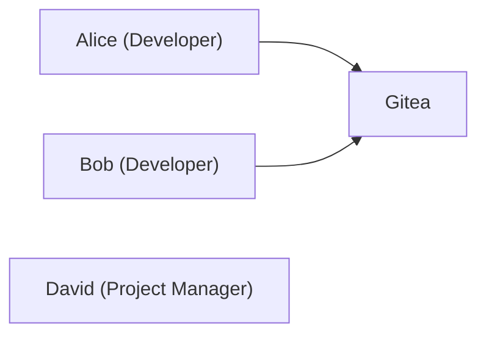
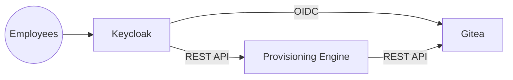
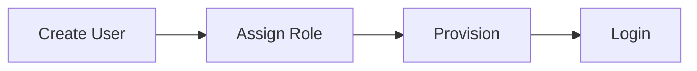
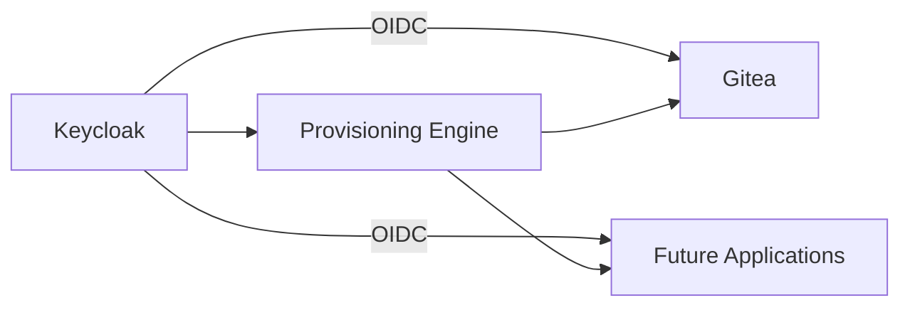

# Architecture

This document describes the architectural evolution of the IAM Labs project and the design decisions behind the current implementation.

---

# Company Scenario

The project is based on a fictional software company called **ACME**.

Initially, ACME is a small startup with fewer than ten employees. The company uses Gitea as its source code management platform and user accounts are managed locally.

As the company grows, identity management becomes increasingly difficult, motivating the adoption of a centralized Identity and Access Management (IAM) solution.

---

# Architecture 0 – Local Authentication

Initially, authentication is performed directly by Gitea.



## Characteristics

- Local user accounts
- Local password management
- Manual user administration
- No centralized identity management

## Limitations

- User onboarding is manual.
- Passwords are stored locally.
- Authentication is application-specific.
- The architecture does not scale well.

---

# Architecture 1 – Centralized Identity Management

Architecture 1 introduces a centralized Identity Provider using Keycloak.

Authentication is delegated to Keycloak through OpenID Connect, while Gitea remains responsible for repository authorization.

A provisioning engine synchronizes users from Keycloak into Gitea.



---

# Design Principles

The current architecture follows a small set of design principles.

| Principle | Description |
|-----------|-------------|
| Centralized Authentication | Users authenticate through Keycloak. |
| Separation of Concerns | Authentication, authorization and provisioning are independent. |
| Role-Based Provisioning | Only authorized users are synchronized to Gitea. |
| Modularity | The provisioning engine is connector-based. |
| Extensibility | Additional services can be integrated without redesigning the architecture. |

---

# Identity Lifecycle

The user lifecycle is managed centrally.



Only users assigned the Keycloak realm role

```text
gitea-user
```

are provisioned into Gitea.

---

# Future Evolution

The current implementation represents **Architecture 1**.

Future versions will extend the same architecture to additional services while reusing the existing Identity Provider and provisioning engine.



---

# Summary

The project evolved from a simple local authentication model to a centralized IAM architecture.

The current design separates authentication, authorization and provisioning, providing a scalable foundation for integrating additional enterprise applications.