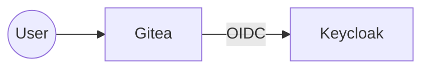
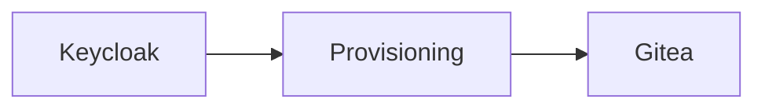

# Gitea Configuration

This document describes how Gitea is configured and integrated within the IAM Labs architecture.

---

# Overview

Gitea is the first application integrated into the centralized Identity and Access Management (IAM) infrastructure.

Within the project, Gitea is responsible for:

- Source code hosting
- Repository management
- User authorization

User authentication is delegated to **Keycloak** through OpenID Connect (OIDC).

---

# Role in the Architecture

Gitea no longer authenticates users locally.

Instead, it relies on Keycloak as the centralized Identity Provider.

---

# Authentication

An OpenID Connect authentication source is configured in Gitea.

| Setting | Value |
|----------|-------|
| Provider | OpenID Connect |
| Identity Provider | Keycloak |
| Authentication | External |

After a successful authentication, Gitea creates a local session for the authenticated user.

---

# User Provisioning

Although authentication is delegated to Keycloak, Gitea still maintains its own local user database.

User accounts are created automatically by the provisioning engine.

This allows Gitea to associate repositories, permissions and activities with local accounts while relying on Keycloak for authentication.

---

# Local Administrator

The local administrator account is intentionally preserved.

| User | Purpose |
|------|---------|
| `admin` | Emergency administrative access |

The administrator account is excluded from provisioning and remains available even if the Identity Provider is temporarily unavailable.

---

# Personal Access Token

The provisioning engine communicates with Gitea using the REST API.

An administrator **Personal Access Token (PAT)** is required.

The token is used to:

- Read existing users
- Create new users
- Execute future provisioning operations

The token should be treated as a secret and never committed to version control.

---

# Organizations and Teams

The current implementation focuses on user provisioning.

Repository permissions continue to be managed directly inside Gitea.

Future versions may extend the provisioning engine to synchronize:

- Organizations
- Teams
- Team memberships
- Repository permissions

---

# First Login

When a provisioned user accesses Gitea for the first time, the application may request the user to **link the local account** with the external OpenID Connect identity.

This behavior prevents an external identity from being automatically associated with an existing local account.

Once the account has been linked, subsequent logins are performed transparently through Keycloak.

---

# Current Configuration

The current implementation provides:

| Feature | Status |
|----------|--------|
| OpenID Connect | ✅ |
| Centralized Authentication | ✅ |
| Local Administrator | ✅ |
| User Provisioning | ✅ |
| REST API Integration | ✅ |
| Organization Provisioning | ❌ |
| Team Provisioning | ❌ |

---

# Summary

Within the IAM Labs architecture, Gitea is no longer responsible for authenticating users.

Instead, it delegates authentication to Keycloak while continuing to manage repositories, permissions and user activity.

The provisioning engine bridges the gap between centralized identity management and application-specific user accounts, allowing Gitea to remain lightweight while integrating seamlessly into the IAM architecture.