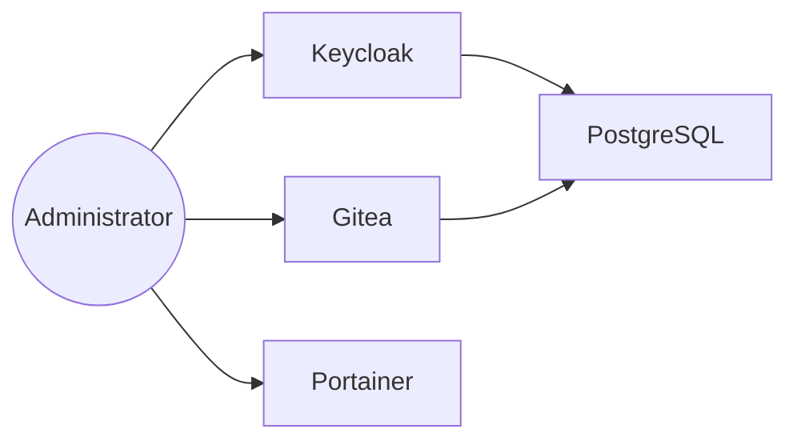

# Installation Guide

This document describes how to deploy and configure the IAM Labs environment.

---

# Prerequisites

The following software must be installed before deploying the laboratory.

| Software | Version |
|----------|---------|
| Docker | Latest |
| Docker Compose | Latest |
| Git | Latest |
| Python | 3.13+ |

---

# Repository

Clone the project.

```bash
git clone https://github.com/<your-account>/IAM_Labs.git

cd IAM_Labs
```

---

# Start the Infrastructure

The laboratory is deployed using Docker Compose.

Move to the compose directory.

```bash
cd infrastructure/compose
```

Start all services.

```bash
docker compose up -d
```

Verify that every container is running.

```bash
docker ps
```

The expected services are:

- PostgreSQL
- Keycloak
- Gitea
- Portainer

---

# Infrastructure

The deployed architecture is shown below.



---

# Keycloak Configuration

After the infrastructure has started, configure Keycloak.

The following steps are required:

1. Create the **ACME** realm.
2. Create the **gitea** client.
3. Configure OpenID Connect.
4. Create the required realm roles.
5. Create the initial users.

A detailed configuration guide is available in:

```
docs/keycloak.md
```

---

# Gitea Configuration

Configure Gitea to authenticate users through Keycloak.

Required steps:

1. Create the administrator account.
2. Configure the OpenID Connect authentication source.
3. Disable local user registration.
4. Generate an administrator Personal Access Token.

Further details are available in:

```
docs/gitea.md
```

---

# Provisioning Engine

Install the required Python dependencies.

```bash
cd provisioning

pip install -r requirements.txt
```

Configure the environment variables.

Example:

```text
KEYCLOAK_URL=http://localhost:8080
KEYCLOAK_REALM=ACME

KEYCLOAK_CLIENT_ID=admin-cli
KEYCLOAK_USERNAME=admin
KEYCLOAK_PASSWORD=password

GITEA_URL=http://localhost:3000
GITEA_TOKEN=<personal_access_token>
```

---

# Verify the Installation

Execute the provisioning engine in **dry-run** mode.

```bash
python sync_users.py
```

Expected output:

```text
============================================================
Provisioning Plan
============================================================

CREATE

None

UPDATE

None

DISABLE

None

Dry run completed.
```

The provisioning engine is now ready for production execution.

---

# Next Steps

Once the installation has been completed:

- Configure OpenID Connect.
- Create Keycloak users.
- Assign the `gitea-user` role.
- Execute the provisioning engine.
- Authenticate through Gitea using Keycloak.

---

# Troubleshooting

For common installation issues, refer to:

```
docs/troubleshooting.md
```