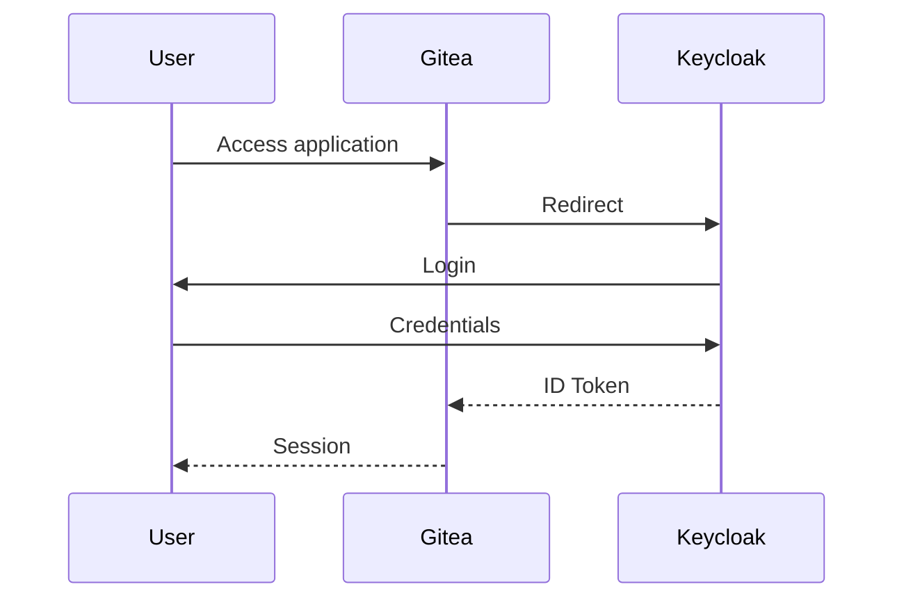
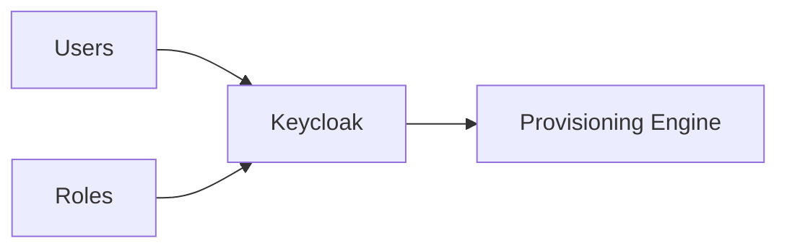

# Keycloak Configuration

This document describes how Keycloak is configured within the IAM Labs project.

---

# Overview

Keycloak acts as the centralized **Identity Provider (IdP)**.

Its responsibilities include:

- User management
- Authentication
- Single Sign-On (SSO)
- Role management
- OpenID Connect token issuance

Applications no longer manage user credentials directly. Instead, they delegate authentication to Keycloak.

---

# Realm

The project uses a dedicated realm.

| Property | Value |
|----------|-------|
| Realm Name | `ACME` |

The realm represents the security boundary for the organization and contains all identities, roles and client configurations.

---

# Users

All identities are managed inside Keycloak.

Example users:

| User | Department | Gitea Access |
|------|------------|--------------|
| Alice | Development | ✅ |
| Bob | Development | ✅ |
| David | Project Management | ❌ |

Users are created only once and can later access multiple integrated applications.

---

# Roles

The project uses **Realm Roles** to determine which users should be provisioned.

Current roles:

| Role | Purpose |
|------|---------|
| `gitea-user` | Allows provisioning into Gitea |

The provisioning engine only synchronizes users assigned the `gitea-user` role.

This approach separates **identity management** from **application access**.

---

# OpenID Connect Client

A dedicated OpenID Connect client is configured for Gitea.

| Setting | Value |
|----------|-------|
| Client ID | `gitea` |
| Protocol | OpenID Connect |
| Access Type | Confidential |

The client is responsible for authenticating Gitea users through Keycloak.

---

# Authentication Flow

Authentication is delegated to Keycloak.

User passwords are never validated by Gitea.

---

# Provisioning Integration

Keycloak also serves as the source of truth for the provisioning engine.

The provisioning engine retrieves:

- Users
- Email addresses
- Assigned roles

Only users matching the provisioning policy are synchronized.

---

# Best Practices

The current implementation follows several good practices.

- Centralized identity management
- Role-based provisioning
- Standard authentication protocol (OIDC)
- Separation between authentication and authorization
- No local password management inside applications

---

# Summary

Keycloak represents the central identity repository of the IAM Labs architecture.

It is responsible for authenticating users, managing identities and roles, and providing the information required by the provisioning engine to synchronize application accounts.