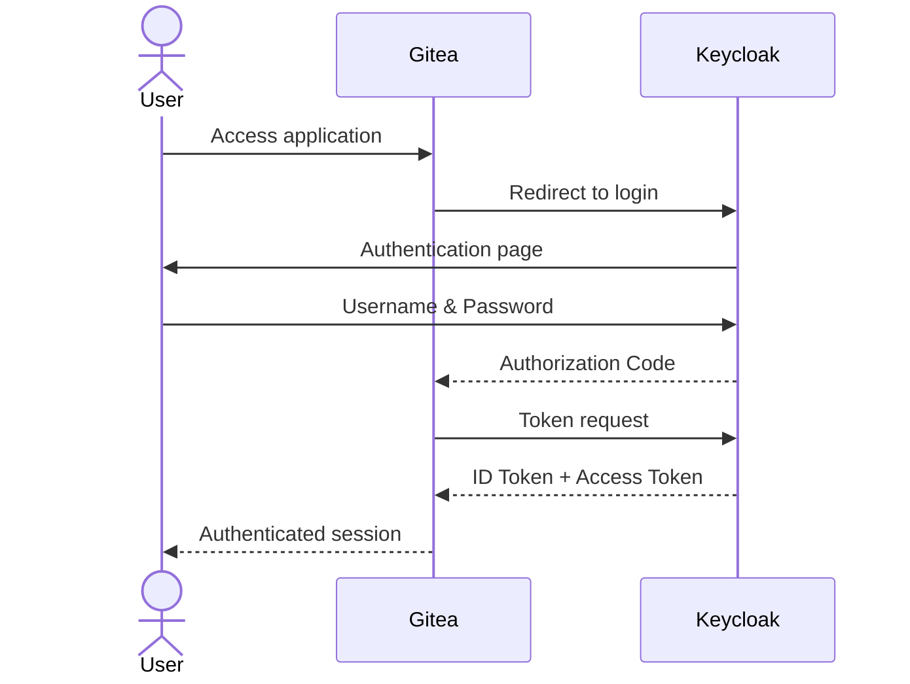

# OpenID Connect (OIDC)

This document describes how OpenID Connect (OIDC) is used within the IAM Labs project to provide centralized authentication and Single Sign-On (SSO).

---

# Overview

OpenID Connect is the authentication protocol adopted by the project.

Instead of authenticating users locally, Gitea delegates the authentication process to Keycloak.

This allows users to authenticate once through the Identity Provider and access the application without managing separate credentials.

---

# Components

The authentication process involves three actors.

| Component | Role |
|-----------|------|
| User | Requests access to the application |
| Gitea | OpenID Connect Client |
| Keycloak | Identity Provider (IdP) |

---

# Authentication Flow

The project uses the **Authorization Code Flow**.

Once authenticated, Gitea creates a local session for the user.

---

# Authentication Responsibilities

Authentication and authorization are intentionally separated.

| Responsibility | Component |
|----------------|-----------|
| User authentication | Keycloak |
| Credential validation | Keycloak |
| User session | Gitea |
| Repository authorization | Gitea |

This separation follows common enterprise IAM practices.

---

# User Lifecycle

Authentication does not create users.

Before a user can access Gitea:

1. The user must exist in Keycloak.
2. The user must be assigned the `gitea-user` role.
3. The provisioning engine must synchronize the user into Gitea.

Only after these steps can the user authenticate through OIDC.

---

# First Login

When a provisioned user accesses Gitea for the first time, Gitea may request the user to **link the existing local account** with the external OpenID Connect identity.

This is a security mechanism that prevents unauthorized association of external identities with existing local accounts.

After the account has been linked once, subsequent logins are performed transparently through Keycloak.

---

# Advantages

Using OpenID Connect provides several benefits.

- Centralized authentication
- Single Sign-On
- Reduced password management
- Improved security
- Easier user administration
- Standard-based integration

---

# Summary

OpenID Connect provides centralized authentication for the IAM Labs architecture.

Applications no longer manage user credentials directly, while authentication is delegated to Keycloak and authorization remains under the responsibility of the target application.