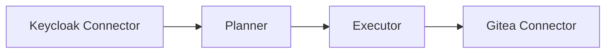
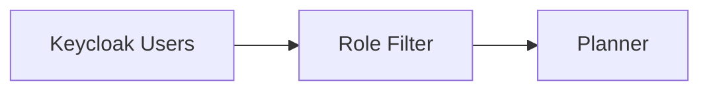

# Provisioning Engine

This document describes the architecture and workflow of the provisioning engine used to synchronize users between Keycloak and Gitea.

---

# Purpose

The provisioning engine automates the user lifecycle by synchronizing identities from the Identity Provider to the target application.

In the current implementation:

- **Source:** Keycloak
- **Target:** Gitea

The engine follows a reconciliation approach: it compares the current state of both systems before applying any changes.

---

# Architecture

The provisioning engine is composed of four independent modules.



Each module has a single responsibility.

| Module | Responsibility |
|----------|----------------|
| Connectors | Communicate with external systems |
| Planner | Compute the provisioning plan |
| Executor | Apply provisioning actions |
| sync_users.py | Orchestrate the workflow |

---

# Workflow

The synchronization process consists of four steps.


1. Retrieve users from Keycloak.
2. Retrieve users from Gitea.
3. Compare both datasets.
4. Execute the provisioning plan.

---

# Provisioning Plan

The planner computes the required actions before any modification is performed.

Current operations:

| Operation | Description |
|------------|-------------|
| CREATE | Create missing users |
| UPDATE | Update existing users *(planned)* |
| DISABLE | Disable users *(planned)* |

This allows the engine to support **dry-run** executions before applying changes.

---

# Role-Based Provisioning

Not every Keycloak user should exist inside Gitea.

Provisioning is controlled by the Keycloak realm role:

```text
gitea-user
```

Only users assigned this role are included in the provisioning plan.



This makes the engine reusable for additional applications by introducing application-specific roles.

---

# Current Implementation

The current version supports:

- User discovery
- Role filtering
- User creation
- Dry-run execution
- Provisioning plan generation

The following features are planned:

- User updates
- User disabling
- Team synchronization
- Scheduled execution

---

# Design Considerations

The provisioning engine has been intentionally designed as a modular component.

Separating connectors, planning and execution provides several advantages:

- Reduced coupling
- Easier testing
- Reusable connectors
- Extensibility
- Simpler maintenance

Adding support for a new application only requires implementing a new connector.

---

# Summary

The provisioning engine is responsible for synchronizing application accounts with the centralized Identity Provider.

Its modular architecture provides a scalable foundation for integrating additional services while keeping the provisioning logic independent from application-specific implementations.