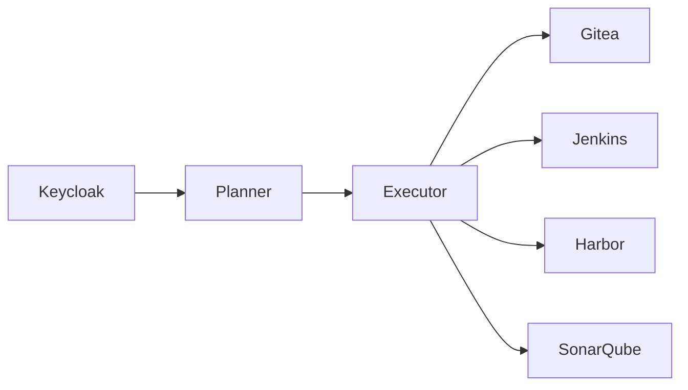

# Roadmap

This document outlines the planned evolution of the IAM Labs project.

The current implementation represents the first complete version of the architecture and establishes the foundation for future extensions.

---

# Current State

The project currently provides:

- Docker-based infrastructure
- Keycloak as Identity Provider
- OpenID Connect authentication
- Gitea integration
- Single Sign-On (SSO)
- Role-based user provisioning
- Modular provisioning engine

This version is referred to as **Architecture 1**.

---

# Short-Term Goals

The next development phase focuses on completing the provisioning engine.

## User Update

Synchronize changes made in Keycloak.

Examples include:

- Email address
- First name
- Last name
- Account status

Current status:

- Planned

---

## User Disable

Disable application accounts when users are no longer authorized.

Current status:

- Planned

---

## Improved Logging

Introduce structured logging for provisioning operations.

Possible improvements:

- Log levels
- Audit trail
- Error reporting

Current status:

- Planned

---

# Medium-Term Goals

The provisioning engine will gradually evolve into a generic synchronization framework.

---

## Team Provisioning

Automatically synchronize:

- Teams
- Team memberships

from Keycloak into Gitea.

Current status:

- Planned

---

## Scheduled Synchronization

Execute provisioning automatically using a scheduler instead of manual execution.

Possible implementations:

- Cron
- Systemd timer
- Container scheduler

Current status:

- Planned

---

## Generic Connectors

The current engine is designed around connectors.

Future versions may support additional applications simply by implementing new connectors.

Examples include:

- GitLab
- Jenkins
- Harbor
- Nexus Repository
- SonarQube

No changes to the planner or executor should be required.

---

# Long-Term Vision

The long-term objective is to evolve the project into a generic Identity Provisioning Framework.



Applications become interchangeable by implementing dedicated connectors.

---

# Possible Enhancements

Future versions may include:

- SCIM support
- Group provisioning
- Organization provisioning
- Secret management
- Configuration profiles
- Web-based administration
- Metrics and monitoring
- Unit and integration tests
- CI/CD pipeline

---

# Design Philosophy

The project is intentionally developed in incremental iterations.

Each architectural version introduces a new capability while preserving the existing design.

This approach allows the system to evolve without requiring major architectural changes.

---

# Future Architecture

The current implementation represents the transition from:

```text
Architecture 0

Local Authentication

↓

Architecture 1

Centralized Identity
Provisioning
SSO

↓

Architecture 2

Multiple Applications
Generic Connectors
Advanced Provisioning
```

The goal is to maintain a modular architecture that can grow alongside the organization's needs.

---

# Conclusion

IAM Labs is intended as an educational project demonstrating modern Identity and Access Management concepts.

Although the current implementation focuses on Keycloak and Gitea, the architecture has been designed to remain modular, extensible and adaptable to additional enterprise applications.